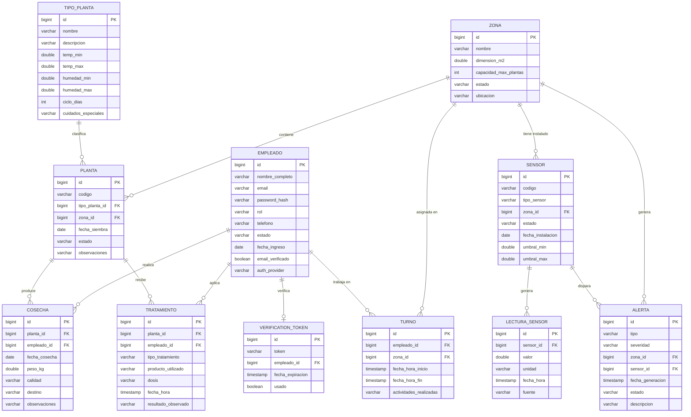

# GreenHouse Manager — Diagrama Entidad-Relación

**Autores:** Cesar Camilo Hoyos Diaz - Alvaro Julian Delgado Mena  
**Fecha:** 2026  
**Asignatura:** Electiva de Ingeniería de Software

---

## Diagrama ER (Mermaid)

---

## Descripción de relaciones

| Relación                      | Cardinalidad | Descripción                                                        |
| ----------------------------- | :----------: | ------------------------------------------------------------------ |
| ZONA → PLANTA                 |     1:N      | Una zona contiene muchas plantas; cada planta pertenece a una zona |
| ZONA → SENSOR                 |     1:N      | Una zona tiene varios sensores físicos instalados                  |
| ZONA → ALERTA                 |     1:N      | Las alertas se asocian a la zona donde ocurrió el evento           |
| ZONA → TURNO                  |     1:N      | Los turnos de empleados se asignan por zona                        |
| TIPO_PLANTA → PLANTA          |     1:N      | Un tipo define los parámetros ideales para muchas plantas          |
| EMPLEADO → COSECHA            |     1:N      | Un empleado puede registrar múltiples cosechas                     |
| EMPLEADO → TRATAMIENTO        |     1:N      | Un empleado puede aplicar múltiples tratamientos                   |
| EMPLEADO → TURNO              |     1:N      | Un empleado puede tener varios turnos asignados                    |
| EMPLEADO → VERIFICATION_TOKEN |    1:0..1    | Cada empleado local tiene un token de verificación de correo       |
| PLANTA → COSECHA              |     1:N      | Una planta puede tener múltiples cosechas a lo largo de su ciclo   |
| PLANTA → TRATAMIENTO          |     1:N      | Una planta puede recibir múltiples tratamientos                    |
| SENSOR → LECTURA_SENSOR       |     1:N      | Un sensor genera muchas lecturas en el tiempo                      |
| SENSOR → ALERTA               |     1:N      | Un sensor puede disparar múltiples alertas                         |

---

## Enumeraciones del modelo

### EMPLEADO.rol

| Valor           | Descripción                                            |
| --------------- | ------------------------------------------------------ |
| `ADMINISTRADOR` | Acceso total al sistema, gestión de empleados y zonas  |
| `SUPERVISOR`    | Supervisión de operaciones, puede atender alertas      |
| `EMPLEADO`      | Operaciones básicas: registrar cosechas y tratamientos |

### EMPLEADO.estado

| Valor      | Descripción              |
| ---------- | ------------------------ |
| `ACTIVO`   | Puede acceder al sistema |
| `INACTIVO` | Acceso deshabilitado     |

### EMPLEADO.auth_provider

| Valor    | Descripción                                                   |
| -------- | ------------------------------------------------------------- |
| `LOCAL`  | Autenticación con email y contraseña + verificación de correo |
| `GOOGLE` | Autenticación OAuth2 con cuenta de Google                     |

### PLANTA.estado

| Valor                 | Descripción                                        |
| --------------------- | -------------------------------------------------- |
| `SEMBRADA`            | Recién plantada, en etapa inicial                  |
| `EN_CRECIMIENTO`      | En desarrollo activo                               |
| `LISTA_PARA_COSECHAR` | Alcanzó madurez, pendiente de cosecha              |
| `COSECHADA`           | Cosecha completada                                 |
| `MUERTA`              | Planta perdida por enfermedad, plaga u otro factor |

### SENSOR.tipo_sensor

| Valor         | Unidad | Rango típico |
| ------------- | ------ | ------------ |
| `TEMPERATURA` | °C     | 10 – 40      |
| `HUMEDAD`     | %      | 0 – 100      |
| `PH`          | pH     | 4.0 – 9.0    |
| `CO2`         | ppm    | 300 – 2000   |
| `LUZ`         | lux    | 0 – 100000   |

### ALERTA.severidad

| Valor     | Criterio                    |
| --------- | --------------------------- |
| `BAJA`    | Desviación < 10% del umbral |
| `MEDIA`   | Desviación 10–25%           |
| `ALTA`    | Desviación 25–50%           |
| `CRITICA` | Desviación > 50%            |

### COSECHA.calidad

| Valor | Descripción                                             |
| ----- | ------------------------------------------------------- |
| `A`   | Premium — frutos uniformes, sin defectos                |
| `B`   | Estándar — pequeñas imperfecciones aceptables           |
| `C`   | Descarte — defectos visibles, uso interno o eliminación |

### COSECHA.destino

| Valor             | Descripción                  |
| ----------------- | ---------------------------- |
| `VENTA`           | Producto comercializado      |
| `CONSUMO_INTERNO` | Uso propio del invernadero   |
| `DESCARTE`        | Eliminación por mala calidad |

### TRATAMIENTO.tipo_tratamiento

| Valor           | Descripción                          |
| --------------- | ------------------------------------ |
| `FERTILIZACION` | Aplicación de nutrientes al sustrato |
| `PESTICIDA`     | Control de plagas o enfermedades     |
| `PODA`          | Eliminación de partes no deseadas    |
| `RIEGO_MANUAL`  | Irrigación complementaria manual     |
| `REVISION`      | Inspección sin intervención física   |
